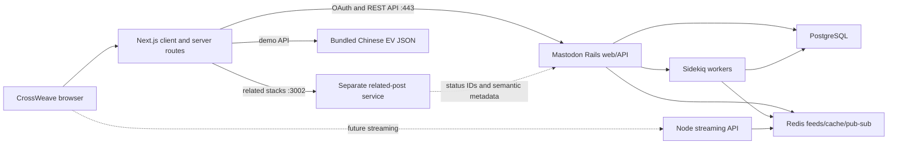
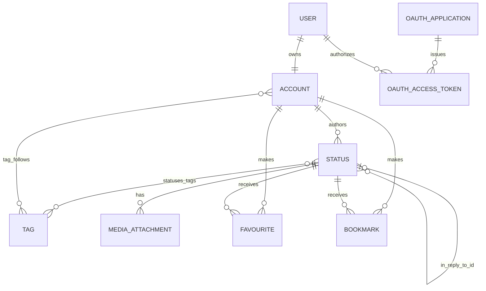
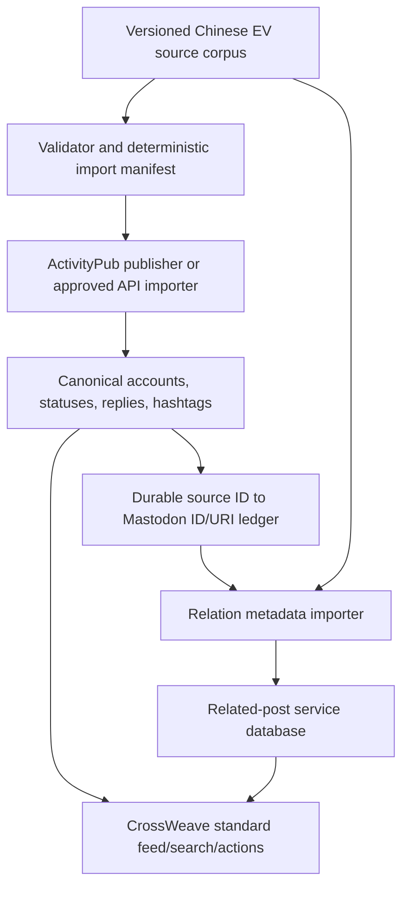

# Mastodon architecture and Chinese EV corpus migration

_Repository and live-service review: 2026-08-11. Planning only; no server files or live data were changed._

## Executive summary

CrossWeave currently talks to two backend systems and one bundled demo source:

1. `https://beta.stacky.social` is a Mastodon 4.3-era server. It owns accounts, OAuth, statuses, replies, hashtags, follows, likes, bookmarks, search, timelines, and ActivityPub federation.
2. `https://beta.stacky.social:3002` is a separate related-post service. It owns Stacky-specific groupings and annotations exposed through routes such as `/stacks/{statusId}/related`. That service is **not** in the checked-out `stacky-social/server` repository.
3. `src/app/FakeData/listy-injection.json` is the current Chinese EV research corpus. A simulated Next.js API paginates it, while client resolvers supply thread and semantic-relation behavior.

The sibling `server` checkout is effectively upstream Mastodon, not a Stacky-specific fork in its current state. No `/stacks`, injection, related-post, or annotation models/routes were found. Its `origin/main` is at `7d9a8c959`, described as `v4.2.0-1909-g7d9a8c959`; the live instance reports `4.3.0-alpha.3`. The checked-in Compose file references the upstream `ghcr.io/mastodon/mastodon:v4.2.9` image. Before a deployment, confirm which commit/image and which separate port-3002 service actually run on DigitalOcean.

The recommended target is to keep Mastodon standard:

- publish canonical Chinese EV posts and reply edges into Mastodon;
- identify posts with `#ChineseEVs` so Mastodon search, hashtag follow, and timelines work normally;
- keep semantic related edges, offset annotations, ranks, and AI rewrites in the related-post service, keyed by the new Mastodon status IDs;
- retain the JSON behind a feature-flagged fallback until the imported corpus and relation crosswalk are verified.

Do not write directly to Mastodon's PostgreSQL tables. Use ActivityPub or supported Mastodon APIs plus a durable import ledger.

## Current runtime topology



### Mastodon processes and storage

The server repository's documented topology is conventional Mastodon:

| Layer | Responsibility | Evidence in `../server` |
|---|---|---|
| Rails/Puma | HTML, OAuth provider, REST API, ActivityPub ingress | `config/routes.rb`, `config/routes/api.rb`, `app/controllers/`, `docker-compose.yml` |
| PostgreSQL | Durable accounts, users, statuses, tags, reply edges, interactions, OAuth records | `db/schema.rb` |
| Redis | Timeline feeds, cache, pub/sub, locks, short-lived idempotency records | `app/services/fan_out_on_write_service.rb`, `app/services/post_status_service.rb` |
| Sidekiq | Distribution, federation, link previews, media work, scheduled maintenance | `app/workers/`, `config/sidekiq.yml` |
| Node streaming | WebSocket/user/public/hashtag streaming API | `streaming/`, `docker-compose.yml` |
| Media storage | Status media, avatars, headers; local volume or configured object store | `app/models/media_attachment.rb`, `config/initializers/paperclip.rb` |

The deployment needs at least the `web`, `streaming`, and `sidekiq` processes plus PostgreSQL and Redis. The port-3002 service must be inventoried separately; its permissive CORS response and `/stacks/...` contract show that it is a distinct HTTP application behind nginx.

## Data model relevant to CrossWeave



Important native concepts:

- `accounts` is the public/federated identity. A local `user` owns a local account and authentication credentials; remote accounts have no local user.
- `statuses` stores the author, text, visibility, language, `in_reply_to_id`, and other Mastodon state. A reply tree is native, but a semantic "related to" graph is not.
- `tags` and `statuses_tags` power hashtag timelines; `tag_follows` records a user's followed hashtags.
- `media_attachments` belongs to an account and is attached to a status after upload/processing.
- likes and bookmarks are native `favourites` and `bookmarks` records. The fixture's historical counters cannot safely be assigned to these tables.
- OAuth applications, grants, and access tokens are managed by Doorkeeper.

The REST endpoints CrossWeave already uses or should use are:

| Capability | Mastodon endpoint |
|---|---|
| OAuth authorization/code exchange | `GET /oauth/authorize`, `POST /oauth/token` |
| Verify signed-in account | `GET /api/v1/accounts/verify_credentials` |
| Home timeline | `GET /api/v1/timelines/home` |
| Hashtag timeline | `GET /api/v1/timelines/tag/{tag}` |
| Hashtag state/follow | `GET /api/v1/tags/{tag}`, `POST .../follow`, `POST .../unfollow` |
| Search | `GET /api/v2/search` |
| Create status or reply | `POST /api/v1/statuses` with optional `in_reply_to_id` |
| Thread context | `GET /api/v1/statuses/{id}/context` |
| Media | `POST /api/v2/media`, poll/update the returned attachment, then pass `media_ids` when posting |
| Like/bookmark | `POST /api/v1/statuses/{id}/favourite` and `/bookmark` plus inverse routes |

## OAuth flow and redirect repair

```mermaid
sequenceDiagram
  participant B as Browser
  participant C as CrossWeave Next.js
  participant M as Mastodon Rails/Doorkeeper
  B->>C: GET /api/auth/mastodon/start
  C->>C: Create state and HttpOnly state/redirect cookies
  C-->>B: 307 /oauth/authorize with redirect_uri
  B->>M: Sign in and approve scopes
  M-->>B: GET CrossWeave /callback?code&state
  B->>C: POST /api/auth/mastodon/callback with code&state
  C->>M: POST /oauth/token with same redirect_uri
  M-->>C: Bearer access token
  C->>M: GET /api/v1/accounts/verify_credentials
  M-->>C: Account
  C-->>B: Account and access token; clear temporary cookies
  B->>B: Save session and navigate to /home
```

The redirect bug was in the CrossWeave start route: it preferred generic `APP_URL` over the origin that actually initiated login. A stale deployment value could therefore send the authorization result to an old frontend domain. The client now defaults to `request.nextUrl.origin`, so login returns to the CrossWeave host the user visited. A reverse proxy that rewrites that origin can opt into the narrowly named `OAUTH_REDIRECT_ORIGIN`; generic `APP_URL` is intentionally ignored.

Operational checks before deploying the fix:

1. Register the exact production `https://<current-crossweave-host>/callback` URI on the Mastodon OAuth application. Mastodon requires the authorization and token-exchange `redirect_uri` values to match the registered URI.
2. Remove or ignore the old `APP_URL` in the frontend deployment. Set `OAUTH_REDIRECT_ORIGIN` only if the request URL observed by Next.js is internal.
3. Keep `MASTODON_OAUTH_CLIENT_SECRET` server-only. The callback route still supports the older `NEXT_PUBLIC_MASTODON_OAUTH_CLIENT_SECRET` name as a temporary migration fallback; remove that fallback after every deployment has the server-only variable.
4. The browser currently persists the returned token in `localStorage`. That is outside this redirect repair, but it makes XSS hardening important and should be reviewed before a public launch.

## How Stacky Injection reaches CrossWeave today

`#StackyInjection` is a friendly client label. `src/data/hashtagCatalog.ts` maps it to the actual Mastodon tag `StackyInjectionPost`.

1. The tag page requests `GET /api/v1/timelines/tag/StackyInjectionPost` from Mastodon.
2. Follow/unfollow calls Mastodon's standard tag endpoints.
3. Signed-in Home requests `/api/v1/timelines/home`, then explicitly supplements it with the tag timeline when Mastodon reports the tag as followed. This is necessary because an existing followed tag does not guarantee historical posts are backfilled into a user's Redis home feed.
4. For each focus status, CrossWeave requests `https://beta.stacky.social:3002/stacks/{mastodonStatusId}/related` and renders the returned related groups/cards.

Live inspection found Stacky Injection posts with Mastodon status IDs and tags such as `StackyInjectionPost` and `StackyInjectionRootPost`. The sampled authors are remote-looking actors such as `stephensorace@stacky-fox.com`; sampled status URIs are original Fox News article URLs and `application` is `null`. The actor and object URI hosts differ. This Mastodon fork's normal ActivityPub Create path rejects that mismatch, so the sample points to a custom injection/import path rather than a standard federated Create or the CrossWeave OAuth application.

Neither that publisher nor the port-3002 related service exists in the checked-out server repository. Access to the DigitalOcean deployment should answer:

- which container/image owns port 3002;
- where its source repository and schema live;
- which process created the `stacky-fox.com` and prior NYT actors/statuses;
- whether it keeps a source-ID-to-Mastodon-ID crosswalk;
- whether `stacky-nyt.com` can be restored (the domain did not resolve during this review);
- how relation categories, annotations, rewrites, and stacks are generated and persisted.

## Chinese EV corpus inventory and incompatibilities

The bundled corpus currently contains:

| Item | Count |
|---|---:|
| Feed/focus entries | 6 |
| Unique posts across all roles | 206 |
| Unique accounts/handles | 161 |
| Unique related posts | 154 |
| Reply-role posts | 56 |
| Unique ancestor posts | 3 |
| Relation records across entry references | 1,214 |
| Unique posts over Mastodon's 500-character limit | 54 |
| Unique posts over 1,000 characters | 15 |
| Longest post | 1,497 characters |

There are 610 related-post references because a unique post can relate to more than one focus entry. Thirteen posts occupy more than one role. The import therefore must deduplicate by source post ID before publishing and separately preserve its many-to-many semantic edges.

Native Mastodon cannot losslessly absorb the fixture as a simple REST batch:

- Local API-created statuses are limited to 500 characters. Splitting or truncating 54 posts would invalidate relation offsets and alter conversation meaning.
- The create-status API cannot backdate `created_at`; importing now would change chronology.
- Creating all posts through one OAuth token makes one account their author. Creating 161 local users to mimic people is an identity, consent, security, and maintenance problem.
- Native replies cover `inReplyToId`, but Mastodon has no model for semantic category, rank, topic/comment offsets, contextual AI rewrite, or one post relating to several focus posts.
- Native favourite/reply counters represent real Mastodon interactions and must not be overwritten with fixture counts.
- The fixture has no status media attachments. Its avatar URLs mostly point at a missing-avatar fallback, so there is no media payload to migrate in the first pass.

These constraints explain why the custom Stacky Injection path matters. A newly controlled ActivityPub publisher may still be viable: remote statuses are not subject to the local 500-character validator and can retain exact text and timestamps. It must use compatible actor/object origins accepted by Mastodon, and it must not claim historical identities without legitimate provenance.

## Recommended migration design

### Publication decision

| Approach | Advantages | Disadvantages | Recommendation |
|---|---|---|---|
| Dedicated local `@chineseevs` curator using `POST /api/v1/statuses` | Smallest operational surface; fully standard API; native search/follow/interactions | 500-character limit, current timestamps, one author, relation offsets break if text is split | Good only for a deliberately summarized pilot |
| 161 local Mastodon accounts | Preserves display handles superficially | Impersonation/consent risk, credentials and moderation burden, still 500-character/current-time constraints | Do not use |
| Controlled ActivityPub publisher | Stable controlled URIs make delivery idempotent; preserves exact text, reply graph, and timestamps | Must use actor/object origins accepted by Mastodon; requires publisher engineering, domain ownership, provenance, and federation/security work | Preferred candidate for a lossless study corpus after a staging proof |
| Direct PostgreSQL writes | Can force IDs/timestamps/counters | Bypasses services, tags, feeds, caches, webhooks, federation, validation, and jobs | Never use |

Preferred path: first identify the prior custom injection mechanism. Separately prove a standards-compliant controlled ActivityPub publisher in staging, using compatible controlled actor/object origins and transparent provenance. If neither path is viable, run a one-focus-thread pilot through a clearly labeled local curator account and explicitly accept that it is a summarized derivative rather than a lossless migration.

### Target ownership



Mastodon should own:

- canonical public status identity/URI;
- author/actor;
- exact post text and language;
- `in_reply_to_id` conversation edges;
- `#ChineseEVs` discovery tag;
- media attachments;
- live likes, bookmarks, boosts, replies, and counts.

The related-post service should own:

- focus-status ID to related-status ID edges;
- category, per-category rank, global rank, and stack/group membership;
- canonical plain text used as the offset base;
- focus/content highlight and comment offsets;
- topic labels and contextual AI rewrite/redline payloads;
- corpus/source version and content checksums.

### Durable import ledger

Do not treat the REST `Idempotency-Key` header as a permanent migration ledger. In this server version `PostStatusService` stores that key in Redis for only one hour. Create a durable manifest/table in the importer or related service with at least:

```text
dataset_name, dataset_version, source_post_id, source_checksum,
source_actor_key, publication_method, mastodon_status_id, mastodon_uri,
parent_source_id, imported_at, last_verified_at, state, error
```

For ActivityPub publication, make the actor URI and object URI deterministic from the immutable source ID. Mastodon's unique index on `statuses.uri` then provides another duplicate guard. For API publication, send a deterministic `Idempotency-Key` **and** consult the durable ledger before every create. A rerun with the same checksum must make zero posts; a changed checksum must stop for review rather than silently edit the canonical status.

### Import algorithm

1. Freeze and checksum a named corpus version; validate every relation range against exact canonical plain text.
2. Build one record per unique source post ID. Merge its roles instead of publishing duplicate statuses.
3. Build the reply DAG from ancestors, focus posts, `inReplyToId`, and replies. Reject cycles and missing parents.
4. Resolve the account strategy and provenance. Do not publish as a named person without a controlled actor and explicit basis to do so.
5. Publish parents before children. Persist each returned Mastodon ID/URI before advancing dependents.
6. Add `#ChineseEVs` consistently. If the followed tag should show only entry points, add a second machine-readable role tag (for example `#ChineseEVFocus`) and make the client catalogue point to that tag while search still covers `#ChineseEVs`.
7. Preserve exact plain text. If the chosen publication path changes text, regenerate and manually verify all affected offsets before relation import.
8. Upload real media first when present, wait for processing, preserve alt text, then attach returned IDs. The current corpus can skip this step.
9. Translate every semantic edge through the durable source-to-Mastodon crosswalk and import it into the related service. A post is published once even when related to multiple focuses.
10. Verify each published status, context, tag membership, and related response through public APIs before marking it complete.

### Counts, dates, and presentation policy

- Use Mastodon's live `favourites_count`, `replies_count`, and related interaction state after migration.
- If historical fixture counts are research-relevant, store them as clearly named provenance fields in the companion service; never write them to Mastodon counter tables.
- Preserve original dates only through a supported publisher path. If using the local API pilot, label the original date in provenance and accept that timeline order is import order.
- Keep the original source ID and corpus checksum outside displayed body text. Do not add opaque tracking markers to user-facing posts.
- Make imported/bot/curated identity transparent in account profile and post provenance. AI-modified related-card text remains a CrossWeave presentation and must not overwrite the canonical Mastodon status.

## Rollout and rollback

### Phase 0 — deployment discovery

- Inventory DigitalOcean containers, images, environment, volumes, databases, nginx routes, queues, and backups.
- Locate the port-3002 source/schema and the original injection publisher.
- Reconcile the server clone, Compose image (`v4.2.9`), and live version (`4.3.0-alpha.3`).
- Export the OAuth application's currently registered redirect URIs and replace the retired frontend callback.

### Phase 1 — offline validation

- Generate the unique-post DAG, account report, length report, relation report, and deterministic manifest.
- Run a no-network dry run twice; the second run must plan zero creations.
- Resolve provenance/consent for the 161 handles and choose ActivityPub versus labeled curator pilot.

### Phase 2 — staging pilot

- Import one focus conversation into a non-production instance or clearly isolated staging tag.
- Verify exact text, dates, authors, tags, ancestors/descendants, search, follow behavior, like/bookmark/reply, and relation offsets.
- Test a focus post with no related metadata; the client aside must remain blank without errors.

### Phase 3 — production dual read

- Back up Mastodon and the related service.
- Import in small, rate-limited batches with resumable checkpoints.
- Keep the JSON catalogue/fallback enabled. Prefer Mastodon records when a verified crosswalk entry exists and deduplicate by source mapping.
- Compare counts and screenshots for every focus entry before switching `ChineseEVs` from local to remote in `hashtagCatalog.ts`.

### Phase 4 — cutover

- Point the catalogue at the production Mastodon tag.
- Confirm hashtag follow adds the corpus to Home, search returns accounts/statuses/tags, and normal actions stay on Mastodon.
- Keep JSON read-only fallback for at least one release/study cycle, then remove only after data and annotation exports are reproducible.

### Rollback

The import ledger is the rollback inventory. Disable client discovery first, then delete importer-owned statuses child-first through the supported API (or emit ActivityPub Deletes), remove companion relation rows for that dataset version, and retain tombstoned ledger records so a retry cannot duplicate partially removed objects. Never roll back with broad SQL deletes.

## Verification matrix

Before the final cutover, automate or record evidence for:

- OAuth from each deployed frontend hostname returns to that same hostname and exchanges the exact same callback URI.
- corpus import is idempotent across interruption and full rerun;
- every source post maps to exactly one Mastodon ID/URI;
- reply parents and `/api/v1/statuses/{id}/context` match the source DAG;
- `#ChineseEVs` tag page, follow/unfollow, Home supplementation, search, pagination, and back navigation work;
- like, bookmark, boost/share, reply creation, and profile views use Mastodon IDs;
- related metadata resolves by the new IDs and every annotation slice matches canonical plain text;
- AI rewrite/redline UI changes presentation only and leaves the canonical Mastodon post intact;
- statuses with no related rows render normally with a blank aside;
- media processing, alt text, failure retry, rate-limit backoff, and partial-batch resume work when media is introduced;
- rollback removes only importer-owned objects and a later retry remains duplicate-free.

## Open decisions requiring deployment access

1. What is the current public CrossWeave production hostname and which callback URI is registered on the Mastodon OAuth application?
2. What repository/image/database backs port 3002?
3. Where is the publisher that produced `StackyInjectionPost`, and can it publish a new controlled `#ChineseEVs` collection?
4. Who controls the historical actor domains and has authority to represent the fixture's named handles?
5. Must exact author identity, timestamps, and long text be preserved, or is a labeled curator-summary account acceptable?
6. Should followed `#ChineseEVs` surface all 206 posts or only six focus entry points?
7. Are fixture interaction counts research annotations or intended as public social proof?
8. What retention, moderation, and participant-consent policy applies to the corpus?

Answers to questions 2, 3, and 5 determine the publication mechanism. No backend implementation should start before those are resolved.
